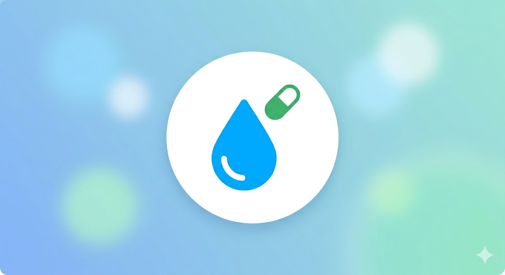
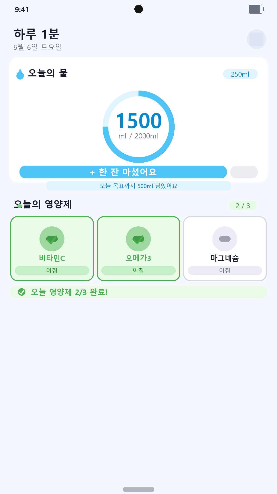
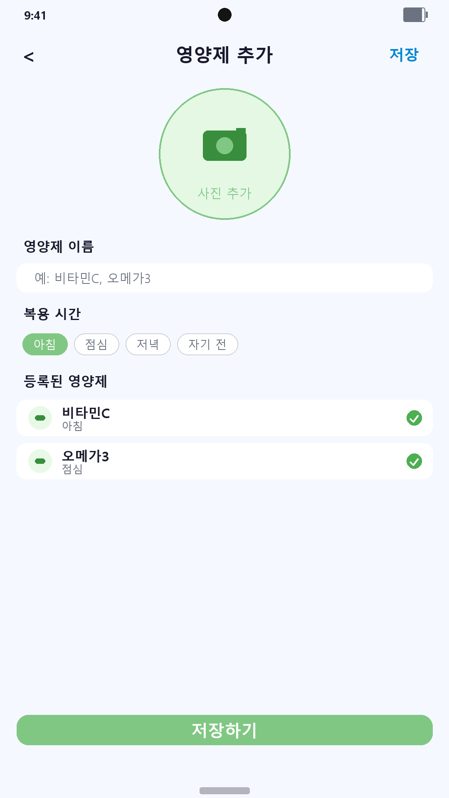

# 하루 1분 (Haru 1Min)

> **물 한 잔, 영양제 한 알 — 1분이면 하루 건강 관리 끝**  
> 버튼 한 번으로 물 섭취를 기록하고, 사진으로 영양제를 등록해 복용 여부를 체크하는 심플한 건강 루틴 앱

<br>

<p align="center">
  
</p>

<p align="center">
  
  
  
  
</p>

<br>

## 주요 기능

**물 섭취 관리**

| 기능 | 설명 |
|---|---|
| 💧 한 잔 기록 | 버튼 탭 한 번으로 물 섭취량 즉시 기록 |
| 🎯 하루 목표 설정 | 일일 목표량 설정 (1500 / 1800 / 2000 / 2500 / 3000ml) |
| 📊 원형 프로그레스 | 오늘 마신 양을 원형 그래프로 한눈에 확인 |
| 🔢 컵 용량 선택 | 150 / 200 / 250 / 300 / 350 / 500ml 선택 가능 |
| ↩️ 되돌리기 | 실수로 눌렀을 때 마지막 기록 취소 |

**영양제 관리**

| 기능 | 설명 |
|---|---|
| 📸 사진 등록 | 카메라 또는 갤러리로 영양제 사진 촬영·등록 |
| ⏰ 복용 시간 설정 | 아침 / 점심 / 저녁 / 자기 전 설정 |
| ✅ 복용 체크 | 탭 한 번으로 오늘 복용 완료 체크 / 해제 |
| ✏️ 수정·삭제 | 길게 눌러서 영양제 정보 수정 또는 삭제 |

**알림**

| 기능 | 설명 |
|---|---|
| 💧 물 마시기 알림 | 매일 지정 시간에 물 마시기 리마인더 |
| 💊 영양제 알림 | 아침 / 점심 / 저녁 / 자기 전 각각 시간 설정 가능 |
| 🔔 개별 ON/OFF | 각 알림을 독립적으로 활성화·비활성화 |
| 🕐 시간 직접 설정 | 타임피커로 원하는 시각으로 변경 |

**홈 화면 위젯**

| 기능 | 설명 |
|---|---|
| 📱 위젯 표시 | 홈 화면에서 오늘 물 섭취량 및 영양제 현황 바로 확인 |
| ➕ 위젯 버튼 | 앱을 열지 않고 위젯에서 바로 물 한 잔 기록 |
| 🔄 자동 동기화 | 앱에서 기록 시 위젯 즉시 갱신 |

<br>

## 기술 스택

- **Flutter 3.41.6** (Dart 3.11.4) — Android 앱
- **flutter_riverpod** — 상태 관리
- **sqflite** — 로컬 DB (물 기록 / 영양제 / 복용 로그)
- **home_widget** — Android 홈 화면 위젯 (인터랙티브)
- **image_picker** — 카메라 / 갤러리 영양제 사진 등록
- **percent_indicator** — 원형 물 섭취 프로그레스
- **flutter_local_notifications** — 로컬 알림 (물 / 영양제 시간대별 매일 반복)
- **timezone** — 정확한 한국 시간 기반 알림 스케줄링
- **shared_preferences** — 목표량 / 컵 크기 / 알림 설정 저장
- **flutter_launcher_icons** — 앱 아이콘 자동 생성

<br>

## 스크린샷

<table>
  <tr>
    <td align="center"><br/>홈 — 물 트래커 + 영양제</td>
    <td align="center"><br/>영양제 추가</td>
  </tr>
</table>

<br>

## 빌드 방법

```bash
# 의존성 설치
flutter pub get

# 디버그 실행
flutter run

# 릴리즈 APK 빌드
flutter build apk --release

# 릴리즈 AAB 빌드 (Play Store)
flutter build appbundle --release

# 앱 아이콘 재생성
flutter pub run flutter_launcher_icons
```

<br>

## 프로젝트 구조

```
lib/
├── main.dart
├── models/
│   ├── supplement.dart            # 영양제 모델
│   └── water_log.dart             # 물 기록 모델
├── database/
│   └── db_helper.dart             # SQLite 헬퍼
├── providers/
│   ├── water_provider.dart        # 물 섭취 상태 관리
│   ├── supplement_provider.dart   # 영양제 상태 관리
│   └── notification_provider.dart # 알림 설정 상태 관리
├── screens/
│   ├── home_screen.dart           # 메인 화면
│   ├── add_supplement_screen.dart
│   └── settings_screen.dart      # 설정 (목표량 + 알림)
├── widgets/
│   ├── water_tracker_widget.dart
│   └── supplement_card.dart
├── services/
│   ├── notification_service.dart  # 알림 초기화 / 스케줄링
│   └── widget_service.dart        # 홈 화면 위젯 동기화
└── theme/
    └── app_theme.dart
```

<br>

## 버전 히스토리

| 버전 | 내용 |
|---|---|
| v1.2.0 | 알림 기능 추가 — 물 마시기 / 영양제 시간대별 매일 알림, 시각 직접 설정 |
| v1.1.0 | 홈 화면 위젯 추가 (물 현황 표시 + 한 잔 버튼) |
| v1.0.0 | 최초 출시 — 물 트래커, 영양제 사진 등록 및 복용 체크 |

<br>

## 개인정보처리방침

[개인정보처리방침 보기](https://p2bble.github.io/haru_1min/privacy.html)

이 앱은 기기 내부에만 데이터를 저장하며, 외부 서버로 개인정보를 전송하지 않습니다.

<br>

## 라이선스

MIT License © 2026 [p2bble](https://github.com/p2bble)
